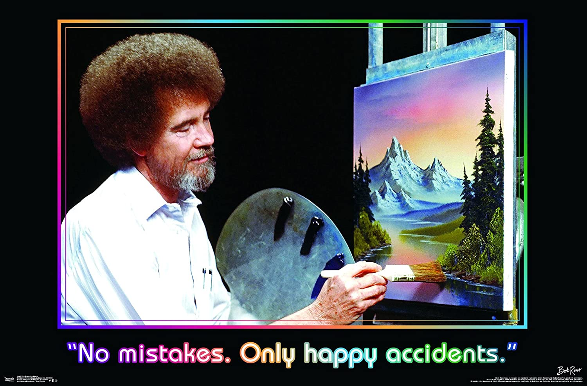
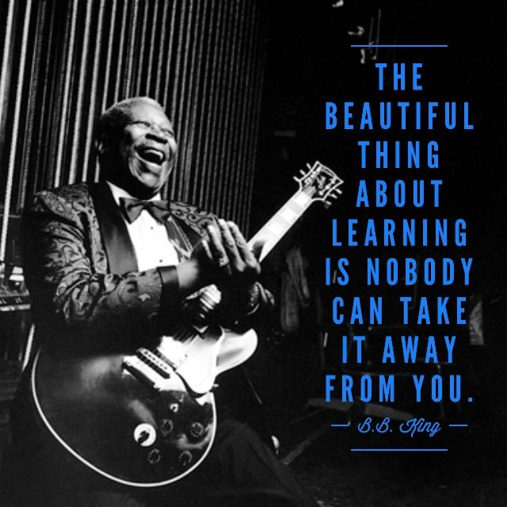

# What is this?
It's an assessment over some core skills that I think you should know by the end of week 1.  

# What are assessments for?
Well, I don't wanna get too philosophizy (that's not a word), but assessments (in my opinion) should be used for communicating knowledge.  In study groups you communicate what you need and what you know.  An assessment is a great tool for communicating to both me and yourself what you know. It's a great time to make mistakes in order to learn about what you are able to and not able to do yet. :) 

# Is this mandatory? 
- No...but like...why wouldn't you do it?

# Instructions
- fork and clone this repo
- open the `assessments.ipynb` file
- Complete the `Necessary Skills` section
- Complete `Level Up` section for some other challenges
- Run the last cell to convert your assessment into a README.md file

## I'll be
checking these around Wednesday evening on the git fork list and I'll just go through and look at each readme.md.

## But Raf
- I'm still new to git, what if I ruin something? Well...
	- Just delete the repo from your github account
	- delete the folder from your computer
	- refork and complete the assessment again!
- I see a solution folder what is that?
	- It's just that. The solutions.  Can you look at it? Yes! Should you? No!
- Why shouldn't I take a peaky peak at the solutions? 
	- Because that's not a true assessment. 
	- Also, this isn't school. There is no fail. Just try and see what you know.  The more you can learn on your own the better you're going to be.  There is no system to game. There is no risk to failure. There is only the reward of learning! :)

# Happy Learning!!!

